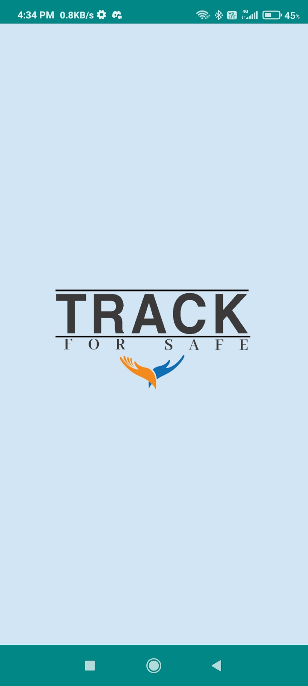

# Track_For_Safe This is our design engineering project
<a href="https://youtu.be/8MlLwU1L9gw"><h3>Youtube video of app</h3></a>

       

The app named Track for Safe aims to solve problems by effectively tracking them. In situations like natural disasters, the app's data can be crucial in saving lives. It has the capability to send notifications to users if they are in the red or orange zone, providing them with timely information for their safety.

We understand that some of our users may not be proficient in English, which is why we offer support in three languages: English, Hindi, and Gujarati. This ensures that language barriers are overcome, and users can fully comprehend the information provided by the app.

If you need to update your location due to a city change, you can easily do so by clicking on the 'Update Location' option. Our backend is powered by Firebase, enabling smooth updates to your location information in our database.

Please note that the current demo version of the app is not fully functional. However, we are actively working on improving its functionality and will provide an update soon.

Thank you for your understanding. We appreciate any feedback or suggestions for improvement.
